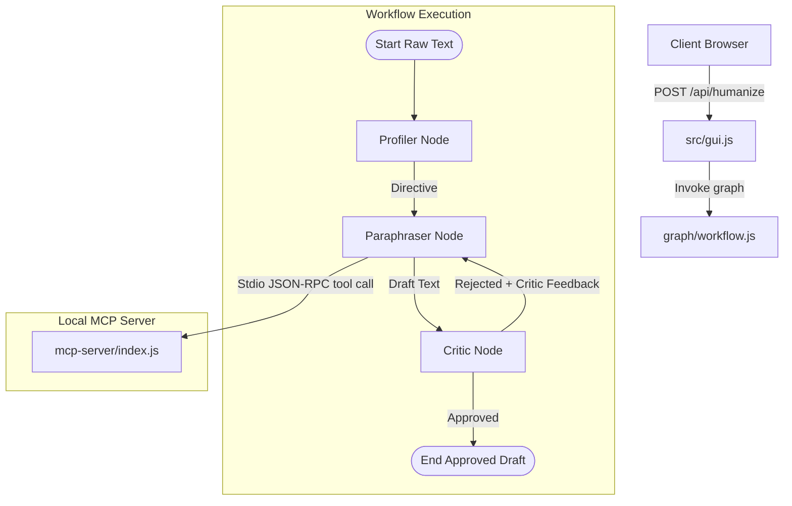

# AI Humanizer Repository State & Architecture Log

This document tracks the current state, architecture, component inventory, and future roadmap of the **AI Humanizer** repository.

---

## 1. Project Overview & Scope
The AI Humanizer is a dual-interface text-rewriting application that modifies machine-like writing style traits (robotic phrasing, predictable transitions, and clichés) to look more human-like.
- **GUI Interface:** Serves an interactive retro-terminal UI over HTTP.
- **MCP Server Interface:** Integrates with LLM orchestrators over stdio.
- **Agentic Workflow:** Employs a multi-agent LangGraph workflow (Profiler -> Paraphraser -> Critic) to process, revise, and verify the text in iterative loops.

**TypeScript Removal:** The project has been fully migrated to pure ES6 JavaScript. No compilation is required, and the application runs natively from the source code. All TypeScript dependencies (`typescript`, `@types/node`) and the `build` script have been completely removed.

**Hugging Face Inference Task Compatibility:** Resolved a task compatibility issue with Hugging Face's serverless providers (e.g. Together AI) by wrapping all LLM invocations in conversational (`chatCompletion`) requests under the hood, ensuring compatibility with instructions models (`Qwen2.5-7B-Instruct` and `Llama-3-8B-Instruct`).

---

## 2. Current Architecture & Data Flow

1. **GUI HTTP Server (src/gui.js):** Emulates Express `req.body` and `res.json` inside the native `http.createServer` POST route. Invokes the LangGraph StateGraph, returning the final approved draft text.
2. **Profiler (Qwen/Qwen2.5-7B-Instruct):** Evaluates input for AI-like markers and creates a styling directive using a `ChatHuggingFace` wrapper (routing calls through the HfInference conversational task).
3. **Paraphraser (meta-llama/Meta-Llama-3-8B-Instruct):** Reads the directive to parse style tone, queries the local MCP server via `get_humanizer_patterns` JSON-RPC call, binds the zod schema tool to a `ChatHuggingFace` wrapper instance, and generates `state.draftText` using the fetched rules over HfInference `chatCompletion`.
4. **Critic (meta-llama/Meta-Llama-3-8B-Instruct):** Evaluates the draft. Throttled by a mandatory 2000ms delay to prevent API rate limits. If rejected, returns feedback; if clean, approves the draft.
5. **Local MCP Server (mcp-server/index.js):** Employs strict Zod schema validation to enforce a `tone` parameter ("casual", "formal", or "balanced") and returns structured pattern replacements imported directly from the `src/patterns.js` library.

---

## 3. Directory & File Inventory

The repository is structured as follows:

- **`src/`** (Pure Vanilla JS sources):
  - [src/index.js](file:///workspaces/agentic-humanizer/src/index.js): Main dual-bootstrapper (MCP stdio server and GUI daemon startup). Calls `process.loadEnvFile()` at start to load variables.
  - [src/gui.js](file:///workspaces/agentic-humanizer/src/gui.js): HTTP static server and API route handlers (triggers the StateGraph workflow).
  - [src/humanize.js](file:///workspaces/agentic-humanizer/src/humanize.js): Rule-based pipeline runner.
  - [src/patterns.js](file:///workspaces/agentic-humanizer/src/patterns.js): Constant dictionaries of style replacements.
  - [src/readability.js](file:///workspaces/agentic-humanizer/src/readability.js): Flesch-Kincaid metric calculator.
  - [src/logger.js](file:///workspaces/agentic-humanizer/src/logger.js): Logging helper.
  - [src/errors.js](file:///workspaces/agentic-humanizer/src/errors.js): Error definitions.
- **`mcp-server/`** (Local MCP server):
  - [mcp-server/index.js](file:///workspaces/agentic-humanizer/mcp-server/index.js): Sets up an MCP server via official SDK. Exposes the `get_humanizer_patterns` tool.
- **`agents/`** (LangGraph workflow nodes - Hugging Face & Vanilla JS):
  - [agents/profiler.js](file:///workspaces/agentic-humanizer/agents/profiler.js): Uses `HfInference` `chatCompletion` ("Qwen/Qwen2.5-7B-Instruct") to generate styling directives.
  - [agents/paraphraser.js](file:///workspaces/agentic-humanizer/agents/paraphraser.js): Connects to MCP patterns server, binds zod schema, and paraphrases text using Llama-3 over `chatCompletion`.
  - [agents/critic.js](file:///workspaces/agentic-humanizer/agents/critic.js): Uses `@huggingface/inference` SDK client with a 2000ms asynchronous throttle delay to evaluate drafts.
- **`graph/`** (Vanilla JS workflow definition):
  - [graph/workflow.js](file:///workspaces/agentic-humanizer/graph/workflow.js): Defines StateGraph using a plain JS configuration object with channels for `rawText`, `directive`, `draftText`, and `status`.

---

## 4. Execution & Verification

The GUI and workflow execute natively:
- `npm start` / `node src/index.js --gui`: Starts HTTP server on port 3000 and stdio MCP server, loading `.env` variables successfully.

---

## 5. Upcoming Tasks & Next Steps

1. **Local Model Caching:** Optional caching optimization for workflow states to avoid repeated remote inference calls.
2. **Extended Metric Logs:** Hook readability metrics directly into execution logs returned to the GUI page.
